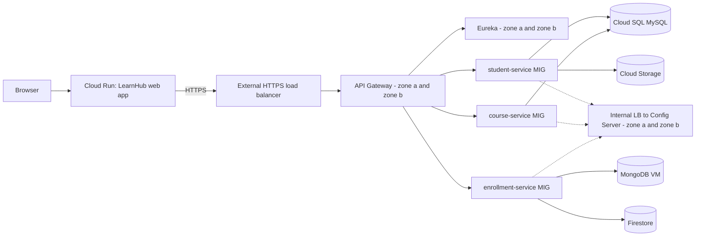

# LearnHub - Backend Platform (parent repository)

Super repository of the LearnHub **platform tier**: Config Server, Eureka registry and API Gateway as Git submodules.

## Student Information

- **Student Name:** M.W. Oshan Shanuka
- **Student Number:** 2301692025
- **Slack Handle:** oshan_shanuka
- **GCP Project ID:** learnhub-capstone

Final project of **ITS 2130 Enterprise Cloud Architecture** (Higher Diploma in Software Engineering, IJSE).

## Project Description

LearnHub is a course administration system built as cloud-native microservices. This parent repository holds the three Spring Cloud platform components as **Git submodules**, each maintained in its own repository:

| Submodule (folder) | Repository | Role |
|---|---|---|
| `eureka-server` | [`learnhub-eureka-server`](https://github.com/iamoshanshanuka/learnhub-eureka-server) | service registry, 2 peer nodes in 2 zones |
| `config-server` | [`learnhub-config-server`](https://github.com/iamoshanshanuka/learnhub-config-server) | centralized configuration, 2 instances in 2 zones |
| `api-gateway` | [`learnhub-api-gateway`](https://github.com/iamoshanshanuka/learnhub-api-gateway) | single entry point, 2 instances in 2 zones |

The business microservices are in the sibling parent repository [`learnhub-backend-services`](https://github.com/iamoshanshanuka/learnhub-backend-services); the web application is in [`learnhub-frontend-web`](https://github.com/iamoshanshanuka/learnhub-frontend-web).

### Architecture



### High availability

All three platform components run on **two VMs in two zones** (`learnhub-platform-a` in `asia-south1-a`, `learnhub-platform-b` in `asia-south1-b`). PM2 manages the processes on each VM. The external HTTPS load balancer sends traffic to both gateways; an internal load balancer does the same for the Config Server; the two Eureka nodes replicate to each other. If a zone fails, the other keeps serving.

## Technology Stack

- Java 25
- Spring Boot 4.0.7 and Spring Cloud 2025.1.2
- Spring Cloud: Netflix Eureka, Config Server, Gateway (WebFlux), LoadBalancer
- PM2 on Compute Engine VMs built from a custom disk image (Java 25, Node.js 22, PM2)
- GCP: VPC, subnets, firewall rules, Cloud Router, Cloud NAT, Cloud DNS (private zone), Compute Engine, instance templates, disk images, health checks, external and internal load balancing, service accounts

## Setup / Getting Started

```bash
git clone --recurse-submodules https://github.com/iamoshanshanuka/learnhub-backend-platform.git
cd learnhub-backend-platform
# already cloned without submodules?   git submodule update --init --recursive
```

Start the components in this order (JDK 25 and Maven 3.9+ required; details are in each submodule's README):

```bash
(cd eureka-server && mvn clean package && java -jar target/eureka-server.jar) &      # http://localhost:8761
(cd config-server && mvn clean package && java -jar target/config-server.jar) &      # http://localhost:8888
(cd api-gateway   && mvn clean package && java -jar target/api-gateway.jar)          # http://localhost:8080
```

Deployment on Google Cloud (summary): a custom image with Java 25 + PM2, two platform VMs (one per zone) started from it, each downloading the three jars from a private bucket and starting them with `pm2 startOrRestart`; then an external HTTPS load balancer for the gateway and an internal load balancer for the Config Server. GCP project: `learnhub-capstone`.
